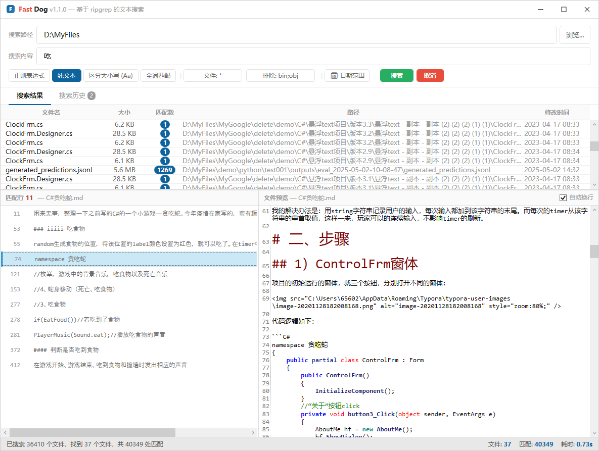

<p align="center">
  
  
  
  
  
</p>

<h1 align="center">
   FastDog
</h1>

<p align="center">
  <strong>快如闪电、简洁优雅的 Windows 文本搜索工具</strong><br>
  <em>基于 ripgrep · WPF 构建 · 零配置开箱即用</em>
</p>

<p align="center">
  <a href="README.md">English</a> | <strong>中文</strong>
</p>

---

### ✨ 为什么选择 FastDog？

- **🚀 极速搜索** — 基于 [ripgrep](https://github.com/BurntSushi/ripgrep)，宇宙最快的文本搜索工具
- **🎯 精准控制** — 支持正则表达式、大小写敏感、全词匹配
- **📁 智能过滤** — 按模式包含/排除文件，自动跳过二进制文件
- **💾 布局持久化** — 窗口位置和搜索历史自动保存，下次启动恢复
- **🎨 现代界面** — 借鉴 VS Code 设计风格，简洁专业
- **📦 单文件可执行** — 无需安装，下载即用
- **🔍 即时预览** — 点击匹配行，立即查看上下文代码高亮预览

### 📸 界面截图

**快速搜索示例**

<p align="center">
  
</p>

### 🚀 快速开始

#### 下载

从 [GitHub Releases](https://github.com/GoodZheng/fastdog/releases) 获取最新版本：

| 文件 | 说明 |
|------|------|
| `FastDog-Setup-{version}.exe` | 安装版（推荐） |
| `FastDog-portable-{version}.zip` | 便携版，解压即可运行 |

#### 从源码构建

```bash
git clone https://github.com/GoodZheng/fastdog.git
cd fastdog
dotnet run --project src/FastDog
```

### 🎯 使用方法

1. **设置搜索路径** — 输入目录路径，或点击"浏览"选择
2. **输入搜索词** — 纯文本或正则表达式
3. **配置选项**（可选）：
   - ☑ 区分大小写
   - ☑ 全词匹配
   - ☑ 正则模式
   - 📅 日期范围过滤
   - 📄 文件类型过滤（如 `*.cs;*.txt`）
4. **点击搜索** — 结果立即呈现
5. **点击结果** — 查看匹配行的上下文预览

### ⌨️ 快捷键

| 快捷键 | 操作 |
|--------|------|
| `Enter` | 开始搜索 |
| `Esc` | 取消搜索 |
| `双击` | 用默认编辑器打开文件 |
| `Ctrl+C` | 复制选中结果 |

### 🔧 配置

FastDog 自动保存以下内容：

- 窗口位置和大小
- 网格分割器位置
- 最近搜索历史（最近 50 条）
- 搜索选项和过滤器

配置数据存储在 `%APPDATA%\FastDog\`

### 🏗️ 技术栈

- **.NET 8** — 现代 .NET 运行时
- **WPF** — Windows 演示基础
- **AvalonEdit** — 语法高亮代码预览
- **ripgrep 14.1.1** — 核心搜索引擎（内置）
- **CommunityToolkit.Mvvm** — MVVM 框架

### 📦 项目结构

```
FastDog/
├── src/
│   └── FastDog/
│       ├── MainWindow.xaml          # 主界面
│       ├── Models/                  # 数据模型
│       ├── Services/                # 业务逻辑
│       ├── ViewModels/              # MVVM 视图模型
│       └── Assets/                  # 图标和资源
├── tools/
│   └── rg.exe                       # 内置 ripgrep
└── tests/
    └── FastDog.Tests/               # 单元测试
```

### 🤝 参与贡献

欢迎贡献！你可以：

- 🐛 报告 Bug
- 💡 建议新功能
- 🔧 提交 Pull Request
- 📝 改进文档

### 📄 许可证

本项目基于 MIT 许可证授权，详见 [LICENSE](LICENSE) 文件。

### 🙏 致谢

- [ripgrep](https://github.com/BurntSushi/ripgrep) — 宇宙最快的搜索工具
- [grepWin](https://github.com/stefankueng/grepWin) — 搜索功能灵感来源
- [.NET Community Toolkit](https://github.com/CommunityToolkit/dotnet) — MVVM 框架

---

<p align="center">
  <sub>由 <a href="https://github.com/GoodZheng">GoodZheng</a> 用 ❤️ 构建</sub>
</p>
